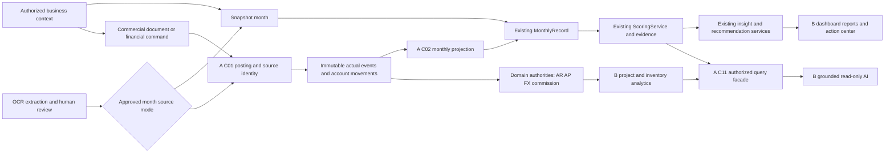

# FinSight Phase 2 master implementation plan

Prepared 10 October 2026 (Asia/Karachi) from the actual integrated MVP and Final Two-Developer Work Division v2.0. This is an implementation **design and onboarding baseline**, not a claim that Phase 2 is built, contracts are signed, or production is accepted. The current contributor is **Developer B**. Start with [implementation state](IMPLEMENTATION_STATE.md) for current tests, remote identity, blockers and next actions.

## 1. Evidence, authority and scope

The live remote baseline is `origin/main=b51e27696cccc59b94aa9d9c9388ad0faa5b4176`, integrated by [PR #3](https://github.com/aviongg/sme-financial-webapp/pull/3) on 8 October 2026. `origin/dev/fatima=b412662866519627ccc81ae80dcc6a5aaf48fe8d` contains main, is 9 commits ahead/0 behind, and initially has an identical tree. Its merge parents are the historical dev/fatima tip `9bc89720e6e42427e3dab9a6061a4a41661d1863` and current main. Commit count is not missing feature count. No older branch needs merging to recover the MVP.

Read the complete evidence in [repository audit](REPOSITORY_AUDIT.md), [backend](audit/BACKEND.md), [frontend](audit/FRONTEND.md) and [financial/schema audit](audit/FINANCIAL_DATA.md). Every V1–V17 migration was inspected; no Phase 2 domain or migration exists at this baseline. Source inspection, automated tests, real disposable PostgreSQL, synthetic browser, and production/provider evidence are distinct categories.

The supplied ownership document is retained as a [normalized source transcript](SOURCE_WORK_DIVISION.md). No Technical Integration Blueprint was attached or found among the supplied inputs; it has not been read and none of its proposed details are treated as existing code. The work division defines 13 headline additions, **14 packages** because F12 splits A/B, plus explicitly committed supporting intelligence. Full ERP production routing, full double-entry accounting, regulatory tax filing, multi-branch hierarchy, external benchmarking and autonomous AI/money actions remain deferred.

**Resolved branch conflict:** the document's sections 5/11/18 prescribe `phase2/integration` and issue branches; the user's direct onboarding instruction instead requires persistent `dev/fatima`, routine tested direct pushes and no unnecessary integration branch or main PR. The direct instruction governs this work and its B workflow. No A feature is reassigned, no dev/suleman/main branch is modified, and no cross-domain financial approval is implied by pushing documentation. Coordination of A's future reviewed commits into B's branch remains a team handoff to record; do not assume A's old branch is a current producer.

## 2. Architecture decisions grounded in the current repository

| Decision | Recommendation and source-based reason | Status |
|---|---|---|
| ADR-D01 application shape | Keep Spring's domain-package modular monolith, Next frontend, PostgreSQL/Flyway and existing FastAPI OCR. No new broker/microservice/base repository abstraction for onboarding. Existing transaction/security boundaries favor in-process domain interfaces. | Design recommendation; no new service/code |
| ADR-D02 financial source | A builds event/posting/account model and the only ledger-mode monthly projection. Reuse MonthlyRecord → ScoringService → saved evidence → advice/dashboard. Historical snapshots remain snapshots. | C01/C02/P01/P02 pending |
| ADR-D03 financial authority | Each amount comes from the single owner table in FINANCIAL_POLICIES. B invoice totals and WAC are real backend calculations; A owns movements, outstanding, commission, FX/funding. C11 delegates to both owners rather than duplicating B calculations. | Ownership fixed; interface draft |
| ADR-D04 business configuration | Extend existing business/profile and authorization with an operating-profile/module resolver. Project/order orientation is distinct from the four current score business types. Enabled modules are availability, not permission. | B C03/P09 review |
| ADR-D05 compatibility | Add `/api/v2` typed decimal-string/evidence contracts while preserving current numeric `/api` DTOs and frontend transport. Add new explicit business/actor columns; preserve legacy financial `user_id` semantics. | B C12 proposal pending freeze |
| ADR-D06 dashboards | Backend allowed-widget registry and batch summaries, four presets, overrides per business+user; reuse existing score/evidence/advice/cash widgets first. | B C10/P09 review |
| ADR-D07 project model | One B-owned project/job/order identifier and versioned approved plans; estimates/sample/stock/invoices attach to it. Actual source allocation separate from budget and settlement timing. | B C05/P05 review |
| ADR-D08 source/OCR | Retain upload/extract/review/corrections. Confirmation dispatches to exactly one approved snapshot/ledger route and can link evidence to an existing source without reposting. | A/B C01/C02/P14 review |
| ADR-D09 AI | B provider-neutral orchestrator calls A C11 typed read tools, including B analytic service adapters; deterministic finance remains authoritative. Prefer a module in existing backend first; an additional service needs a separate cost/privacy/deployment ADR. OCR service remains intact. | P12/provider choice open |
| ADR-D10 schema/release | Additive reviewed migrations, reserve versions centrally, fresh/upgrade/grant/concurrency tests; preserve production role separation and independent deployment acceptance. | Workflow established, no migration reserved |

## 3. Existing-to-new financial flow

The diagram's ledger/query/AI nodes are proposed. Current source has only the snapshot and reviewed-document pipeline. Evidence mode and financial period must follow every new derived result so the UI cannot call a plan an actual balance.

### Snapshot and cutover algorithm to approve

1. Record business base currency, reporting timezone, future whole cutover month and reviewed opening account/obligation/stock balances. Show a dry-run reconciliation, conflicts with existing months and unknown amounts. Do not synthesize daily events for old totals.
2. Keep earlier months in SNAPSHOT with their existing behavior and limitation disclosures. C02 persists explicit mode/lock metadata. Existing confirmed documents retain provenance; linking them to new ledger sources must not re-add old amounts.
3. At/after cutover, only the A-owned projector writes financial monthly values. Existing monthly/OCR APIs check mode. User adjustments become reviewed source commands, never hidden manual edits of projections. A `none/none` archive-only document workflow must be explicitly designed; it is not the current confirmation behavior.
4. Posting transaction validates tenant, policy/version, source key, account/currency and allowed transition; database uniqueness/locks atomically record event, effects, source receipt and audit. Same request retries return the first result; source-effect uniqueness protects against a changed request key.
5. Project from accepted immutable effects using an event watermark; record field basis, availability, source revision and reconciliation result. Rebuild independently and compare. Backdating changes subsequent closing balances, not just the edited month's period sum; propagate scoring for affected record windows.
6. Decide P02 coupling before implementing: today's monthly save rolls back if score calculation fails. A valid ledger event with insufficient scoring data may instead need durable projection/score-unavailable state. That behavior must be explicit, tested and shown as unavailable; no silent failure or invented score.
7. Reversal references its original source and compensates approved effects; it does not delete history. Closed-period adjustments/cutover changes require review. Never reset old migrations or rewrite prior scores to hide differences.

### Monthly projection field contract

| Existing field | Proposed authoritative derivation | Required unresolved policy |
|---|---|---|
| cashInflow/cashOutflow | Accepted external cash-account movements in period, classified separately from recognition; transfer exclusion explicit | Transfer gross-flow convention and account classes, P01/P02 |
| cashBalanceEom | Reviewed openings + signed cash-account movements through period end | Restricted cash/overdraft/negative mapping, P01/P02 |
| revenue | Recognized revenue effects from reviewed document/service rules; cash receipts alone insufficient | P03/P04 |
| operatingExpenses | Recognized expense effects excluding COGS/fee/commission duplication under approved categories | P04/P05/P08/P10 |
| cogs | C07 approved recognized cost effects, not every purchase or stock issue | P06; null until known |
| receivablesOutstanding/payablesOutstanding | C04 residual obligations as of month end, approved base valuation | P03/P10; never sum monthly balances |
| inventoryValue | C07 closing stock valuation at same cutoff/revision | P06; WIP/returns/capitalization |
| loanOutstanding | A-approved financing principal balance, not sum of repayments | P02/P11; unknown if unsupported |
| interestExpense | Approved period expense effects, independent of principal/cash classification | P11 |
| financingType | Preserve current declaration unless approved supported financing classification adapter exists | P11; no silent score/Zakat interpretation change |

Money crossing into `numeric(14,2)` must be explicitly rounded/validated once under P10 and checked for overflow. Financial ratios in B services use raw authoritative decimals until approved output rounding. Existing nullable COGS must remain distinguishable from zero despite the legacy score's documented formula treatment.

## 4. Feature designs and reuse matrix

The register is the current status authority. Detailed specifications are deliberately grouped into three files so a feature chat reads one relevant section instead of fourteen redundant documents. Each headline package has all sixteen requested dimensions: ownership, workflow, reuse, gaps, Java classes, schema/indexes/migrations, calculations, API/DTO, frontend, authorization, integrations, rules/edges, tests/UAT, dependencies, complexity/priority and DoD.

| Packages | Detailed design | Existing assets reused |
|---|---|---|
| F01, F03, F07, F10, F11, F12A | [Platform packages](features/PLATFORM_PACKAGES.md) | monthly/scoring, security/team, cashflow historical trend, audit/OCR transport patterns |
| F04, F05, F06, F08, F09 | [Commercial packages](features/COMMERCIAL_PACKAGES.md) | existing identity, document review/provenance, monthly compatibility and financial UI primitives |
| F02, F12B, F13 | [Experience packages](features/EXPERIENCE_PACKAGES.md) | onboarding/profile, live layouts, API client/session, typed translations, dashboard/score/action cards, document vault basics |
| A financing/scenarios, forecast, alerts/anomalies/risk, secure queries | Platform supporting roadmap | existing trend/evidence/security; new deterministic services, not duplicate scores |
| B budgets/goals/break-even, expense/revenue/customer/product/project profitability, health journey/action center, reporting, copilot/two-way WhatsApp | Experience supporting roadmap | existing recommendations/history/evidence, scheduled outbound WhatsApp/consent, new verified analytic and orchestration services |

New service paths and DTOs are design proposals. [INTEGRATION_CONTRACTS](INTEGRATION_CONTRACTS.md) governs shared field names (including `SourceRef`, version and money); when package detail differs, reconcile it before freeze rather than creating two contracts. No package may silently use a different policy because another module is blocked.

## 5. Dependency-aware two-developer roadmap

Waves are acceptance units, not equal-sized calendar promises. One lead per slice and one shared-file editor at a time. No new integration branch is created for this B workflow. Suggested milestone messages below are descriptions for future coherent commits; they are not present commits or authorization to implement features in onboarding.

| Wave / gate | Developer A | Developer B | Safe parallel work and required handoffs | Exit, tests and expected milestone |
|---|---|---|---|---|
| W0 baseline/contracts | Review audit; draft/freeze C01/C02/C04/C06/C08/C09/C11 in required slices; address finance policy | This onboarding; draft C03/C05/C07/C10/C12; obtain A review of first F02 scope | Independent specifications and reference fixtures; freeze currency/source/project ID early. All contracts remain draft until real approval. | Audits, register, policies, test evidence and workflow committed to dev/fatima; later `docs(phase2): freeze <contract subset>` only with approvals. No empty production stubs. |
| W1 reusable foundation | F01 accounts/posting/projection/cutover, finance races/source/audit prerequisites in scoped tasks | **F02 first**; then F13 core widget/preset/customization slice using current live data | B configuration does not need a fake ledger. F13 can show unavailable future-module widgets until real producer exists. Shared navigation/onboarding/security ownership recorded per slice. | A post/transfer/reverse→month/score, B old/new business/module/role/preset journeys; SQL upgrade/concurrency and score regressions. `feat(configuration): ...`, `feat(workspace): ...`; A producer commit recorded by B on integration. |
| W2 commercial obligations | F03 obligations/partial allocation/advances | F04 draft/totals/templates then real issue/bill approve via C04 | Draft/totals UI can proceed after P04/C04 freeze; issuance/settlement waits for A producer. Early C05 project identity design can proceed separately. | Issue→obligation once; no issue cash; payment→outstanding/cash/month once; cross-tenant/concurrency fixtures. `feat(invoicing): integrate issued documents with obligations`. |
| W3 project economics | F07 calculator/plan/settlement matching from frozen C05/C06 | F05 project/budget/actual integration, F06 estimates→budget, F09 sample plan/recovery | A calculator fixtures and B project persistence parallel after ID/plan freeze; F06 standalone estimates useful before all actual-cost sources. F09 manual approved costs first only if real source exists; stock-material slice waits W4. | Estimate conversion posts no actual; approved project margin and funding reconcile; paid/free sample attribution once. `feat(projects)`, `feat(estimates)`, `feat(samples)` coherent slices, partial status until dependencies land. |
| W4 manufacturing/sales | F10 commission and SALESPERSON authorization, recognized-cost feed | F08 inventory/WAC/usage/COGS, complete stock-backed F09 and F05 cost adapters | A commissions and B stock independent after C01/C05/C07/C08 policies; shared project-source query adaptation reviewed together. | Stock quantity/value/COGS and commission recognized/pay costs each once; concurrent issues, role/list/export denial, manufacturing journey. `feat(inventory): ...` plus integrated project evidence. |
| W5 settlement/operations | F11 FX settlement, F12A import/reconciliation/recurrence | F12B calendar/document links/report/export/scheduling; extend F13 producer widgets | F12B evidence-only document links/core monthly reports can be earlier; accurate FX/calendars wait for source contracts. On-demand authorized reporting precedes scheduled automation. | Exporter settlement/gain/fee and import duplicate/reconciliation fixtures; report/widget equality, EN/UR/mobile; `feat(reporting): ...` and operations adapters. |
| W6 deterministic intelligence | Advanced forecast, financing/scenario, deterministic alerts/anomaly/risk; complete C11 tools | Budgets/goals/break-even, expense/revenue/profitability, action center/health journey, business-specific report/UI | Health history/action presentation can start earlier; forecasts wait on actual obligations/plans. Publish each real query tool as its domain is ready instead of waiting for all seven. | Numeric fixtures/source-date/partial states, query parity and scope; action lifecycle integration; no fake history. `feat(intelligence): <bounded service>` with full backend and UI. |
| W7 AI and conversational WhatsApp | Harden C11 schemas/evidence, query limits and authorization; review mappings | Provider adapter, intent/router/tool calls, bounded orchestration, grounding/output validation/evaluations, copilot; inbound WhatsApp after sender verification | Synthetic offline proof-of-concept/evaluation can precede W6 with clear fixture labeling and no production route. Real copilot waits for real C11. Preserve outbound summary flow. | B evaluation report, A numerical/security signoff, exact no-data/refusal/cross-tenant adversarial tests; approved provider privacy/cost and real delivery tests recorded separately. |
| W8 release acceptance | Fresh/upgrade DB, roles/TLS, financial reconciliation/regression, real encrypted restore | Docker/HTTPS/browser/EN/UR/mobile UAT, report and provider acceptance, release evidence | Joint business journeys on final integrated source; production actions require explicit user authorization. | Both review manufacturing, service/project, exporter, salesperson, legacy cutover and AI journeys. No main PR/deployment in this task. |

**Critical path:** approved posting/cutover/source/currency contract → real C01/C02 → C04 obligations → F04 + C05 actual attribution → C06 funding and C07/C08 cost sources → integrated forecast/query catalog → grounded production AI. The project identifier/plan contract can be frozen before F05 completion; this removes artificial waiting for A's calculators. C09 field design belongs at the start even though settlement implementation is W5.

**B's recommended sequence:** F02 → F13 core → F04 draft/totals then issue integration → F05 project/budget/actual basis → F06 pricing/conversion → F09 plan/paid-free economics → F08 valuation/usage → finish stock/commission project/sample adapters → F12B mature reports/calendar/export → F13 full producer widgets → budgets/goals/break-even/profitability → action/health refinements → copilot → authorized inbound WhatsApp. Move useful document links/monthly reports and health presentation earlier when not blocked; do not label the whole package done from a narrow early slice. Each feature still begins only when the user asks in a new chat.

Assess finance, integration, DB/concurrency and frontend load separately in package specs. F01/F03/F08/F11 are particularly demanding; B has more headline packages and substantial AI/UI work. At each wave re-estimate using fixture complexity and actual lead times. Reduce bottlenecks through frozen contracts, small producer releases, timely cross-review and shared fixtures; reassign work only with explicit agreed responsibility change. Never let B implement a second obligation/FX engine to avoid A's queue.

## 6. Security and financial test gates

Preserve existing cookies/JDBC sessions, MFA authentication stage, CSRF, account-status/auth-version enforcement, active business and current roles. Add granular permissions within BusinessAuthorizationService with both API and UI maps tested. OWNER's current all-enum behavior means each new permission automatically affects OWNER; review that intentionally. SALESPERSON is an A-owned backend row-scope change, not a frontend role label.

Every financial FK/query must carry tenant integrity; guessed IDs, list/filter pagination, exports and AI calls all require the same scope. PostgreSQL composite FKs/unique constraints plus transaction locks enforce identities under concurrency. No alternate JWT, client business-ID authority, raw LLM SQL, financial mutation retry without idempotency or storage URL trust. Module guards complement roles, never bypass them.

Gate order: validate changed docs/contracts → deterministic finance/unit tests → real PostgreSQL migrations/constraints/races → security and contract producer/consumer tests → current frontend type/lint/build and meaningful browser coverage → actual frontend/backend journey → wave numerical reconciliation → separate production/provider acceptance. Existing synthetic browser tests remain useful, but cannot stand in for a live backend. Test counts, skipped/excluded cases and failures belong in implementation state with date/commit/environment.

Existing source findings to schedule explicitly: same-month OCR/manual race and duplicate-source risk; finance audit actor/tenant mismatch; insufficient precision/bounds validation at legacy money boundary; mutable score history; single-instance OCR startup recovery assumption; file/DB lifecycle differences; unbounded list/search queries; incomplete reusable modal focus behavior. These are documented findings, not silently repaired in onboarding or claims of reproduced exploitation. The observed document integration failure must remain in verification evidence even after a passing isolated rerun; its timing-related root cause is not yet proved.

## 7. Database evolution and rollback

V17 is the current source version. Next unreserved candidate is V18 **only if a fresh fetch and all team reservations still confirm that**. No migration is reserved by this onboarding. Record version, feature, author/reviewer, intended filename/status and producer commit in IMPLEMENTATION_STATE; coordinate A reservations even when their work is on another branch. One author may reserve a small necessary consecutive set, never speculative blocks for every feature. Resolve collisions before either number is applied; once applied/shared, never renumber or edit it.

Use explicit business FKs, indexes matching tenant/filter/time queries, precision/bounds/status checks, idempotency uniqueness and role grants. Preserve migrator/runtime separation (`FlywayMigrationRunner`, migration profile, runtime Flyway disabled). Test fresh V1→latest and populated V17→latest plus existing data/evidence, owner/accountant restrictions and required triggers/grants. A prepares DB/recovery acceptance; B still owns quality of its own migrations and Docker/browser rollout tasks. Neither is a universal DB gatekeeper.

Rollback preference is disable a new feature/module safely and retain auditable data, or add a corrective migration; do not delete business data or reverse immutable posted history using SQL. Module disabling cannot make obligations disappear or stop necessary financial integrity operations. Production rollback/deployment requires explicit authorization, tested restore and agreed financial policy.

## 8. Development environment and continuous handoff

Use [DEVELOPMENT_SETUP](DEVELOPMENT_SETUP.md) for reproducible commands and local caveats; [CODEX_WORKFLOW](CODEX_WORKFLOW.md) is mandatory for new B feature chats. There is no tracked GitHub Actions workflow at baseline, so an empty Actions result is not CI success. A future CI pipeline is a distinct scoped change; onboarding does not install unrequested dependencies/services or empty tests.

Documentation map: MASTER_IMPLEMENTATION_PLAN owns architecture/sequence; FEATURE_REGISTER owns package readiness/DoD references; INTEGRATION_CONTRACTS owns DTO/interface drafts/approval; FINANCIAL_POLICIES owns decisions; IMPLEMENTATION_STATE owns present state/reservations/evidence; audit files own dated baseline observations; feature files own detailed proposed slices; prompts/README owns future prompt format. Update rather than append contradictory plans.

Publication is a docs-only milestone on `dev/fatima`. Review the exact staged paths, preserve untracked user files, test documentation references/coverage and unchanged application/migration trees, fetch again, commit, push without force, verify remote SHA. A commit cannot contain its own final hash; record baseline/prior remote in state and identify the publication commit by Git history plus final user report. Subsequent session records that verified head normally. Do not create a recursive chain of commits solely to embed each commit's own hash.
