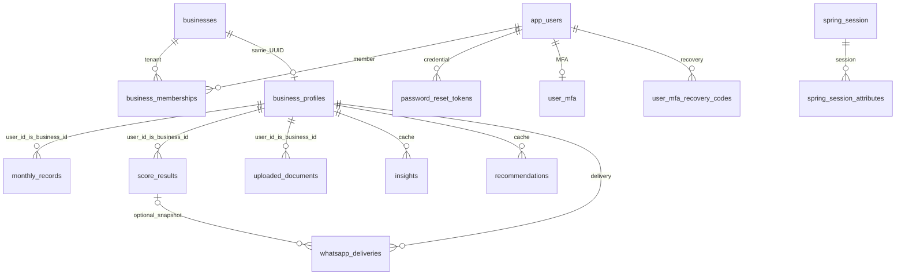
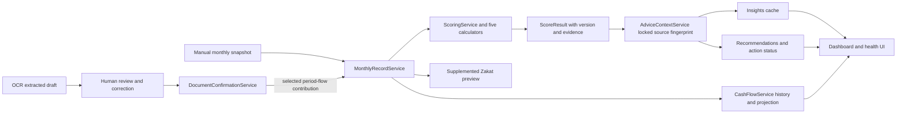

# Financial data, schema and calculation audit

Source inspection completed 10 October 2026 (Asia/Karachi). This document describes repository code, not a deployed-database inspection. The verification ledger in `../IMPLEMENTATION_STATE.md` records commands actually run and their outcomes. Existing behavior is separated from proposed Phase 2 design. No migration or application behavior was changed for this audit.

## 1. What exists and must be reused

The application has a tenant-scoped **monthly snapshot** financial model. Manual entry replaces a business/month snapshot; confirmed OCR can add selected period flows to that snapshot. `MonthlyRecordService` invokes the existing deterministic `ScoringService`, which persists one current score/evidence record per business/month. Insights and recommendations are versioned, lazy-refresh caches of persisted score evidence. Dashboard composition, six-record cash-flow history, next-month trend projection and Zakat previews already exist.

There is no transaction ledger, account register, posting/reversal journal, invoice/bill line model, counterparty obligation ledger, inventory movement valuation, project cost attribution or business cutover mode in V1–V17. Do not describe a document's `confirmed_data` JSON as a transaction ledger. New commercial features must integrate through the proposed A-owned posting/projection contracts instead of independently modifying monthly fields.

All Java paths below are relative to `backend/src/main/java/com/app/sme_health_backend/`; test paths are relative to `backend/src/test/java/com/app/sme_health_backend/`. These are repository navigation paths, not additional modules already implemented.

## 2. Every Flyway migration inspected

Actual source directory: `backend/src/main/resources/db/migration/`. The sequence contains **V1 through V17, no V18** at audit. All listed SQL files were read in full; the table describes their cumulative effects rather than relying on filenames alone. The result is 17 application/session tables plus Flyway's history table.

| Version / exact filename | Actual change and resulting integrity rules |
| --- | --- |
| `V1__initial_schema.sql` | Enables `pgcrypto`. Creates `business_profiles` keyed by `user_id UUID`; checked business type (`trade/manufacturing/services/retail`), language (`en/ur`), WhatsApp preferences. Creates `monthly_records`, `uploaded_documents`, `score_results`, each referring to `business_profiles(user_id)`. Monthly and score rows each have unique `(user_id, month)`. All monthly monetary columns are `NUMERIC(14,2)`; optional balances are nullable. Documents contain raw/confirmed JSONB and status constraint. Scores contain `NUMERIC(5,2)` composite, `NUMERIC(3,2)` completeness and JSONB components. |
| `V2__add_compliance_and_repayment_fields.sql` | Adds nullable profile payment behavior, checked to `immediate/2weeks/1month_plus/irregular`, and nullable `ntn_registered`, `business_registered` booleans. Unknown remains distinct from false. |
| `V3__allow_null_cogs.sql` | Drops COGS NOT NULL and default. Final COGS is nullable with no default; it is not automatically a recorded zero. |
| `V4__create_insights_table.sql` | Creates insights with profile FK, month, required text/category/priority/created time. Priority check `high/medium/low`. Adds `(user_id, created_at DESC)` index. |
| `V5__create_recommendations_table.sql` | Creates analogous recommendations with category width 40 (insights 30), same priority check and tenant/created-time index. |
| `V6__version_and_deduplicate_advice.sql` | Adds nullable source version (64), language (5, checked EN/UR codes), source-computed time to both advice tables. Deletes older duplicate business/month/category rows, then enforces unique `(user_id, month, category)` for each cache. This historical data cleanup must not be replayed by editing the old migration. |
| `V7__add_document_metadata_and_indices.sql` | Adds nullable filename, content type, file size BIGINT, storage path, failure reason, processing-started and confirmed timestamps. Adds indexes on document `user_id`, `(user_id, processing_status)`, `(user_id, linked_month)`. |
| `V8__add_whatsapp_delivery.sql` | Adds profile opt-in time. Creates delivery journal with profile FK `ON DELETE CASCADE` and optional score FK `ON DELETE SET NULL`; required month/fingerprint/cycle/destination/language/template/provider/status and scheduling timestamps. Unique `(user_id, delivery_cycle)`, optional idempotency key without its own unique constraint, checked delivery state, attempt count default zero; indexes tenant/status/cycle. |
| `V9__add_identity_and_authentication.sql` | Creates `app_users` (email unique, account status check), `businesses` (status check) and memberships (user/business FKs with cascade, unique pair, role/status checks, separate user/business indexes). Backfills businesses from profile IDs. Creates Spring Session parent/attributes tables, unique session ID, expiry/principal indexes and cascading attribute FK. Legacy financial `user_id` now denotes business identity, not authenticated person. |
| `V10__link_business_profiles_to_businesses.sql` | Backfills any missing business anchor, then adds `business_profiles(user_id) -> businesses(id) ON DELETE RESTRICT`. Does not migrate financial rows onto app-user IDs or rename legacy columns. |
| `V11__widen_encrypted_pii_columns.sql` | Widens user full name and uploaded original filename to TEXT; profile WhatsApp and delivery destination to VARCHAR(255), for ciphertext envelope storage. Entity converters perform encryption; SQL widening alone does not encrypt rows. |
| `V12__add_security_audit_events.sql` | Creates audit UUID/time/type/outcome/system flag and optional actor/business/target/request/JSON metadata. Actor/business FKs set null on deletion; indexes time, event, actor, business and target pair. Revokes runtime update/delete/truncate; grants insert/select. Triggers reject mutation except the narrowly checked clearing of actor/business linkage compatible with FK deletion. Requires pre-provisioned `finsight_app` role. |
| `V13__add_password_reset_tokens.sql` | Creates user-cascading reset token table, unique 64-char hash, expiry/created timestamps, nullable used/revoked timestamps, user and `(token_hash, used_at, revoked_at, expires_at)` indexes. |
| `V14__add_platform_role_and_mfa.sql` | Adds optional checked `PLATFORM_ADMIN` role and required auth version default zero to users; partial platform-role index. Runtime-role trigger forbids changing platform role by UPDATE. Creates user-keyed MFA and user-linked recovery-code tables with cascading user FKs, MFA status check and lookup indexes. |
| `V15__restrict_flyway_history_privileges.sql` | Revokes all access to `public.flyway_schema_history` from PUBLIC and `finsight_app`; does not change future-domain default DML grants. Requires Flyway history in public and expected roles. |
| `V16__score_explainability_and_actions.sql` | Adds nullable score methodology version and JSONB explanation. Leaves legacy evidence null intentionally. Adds recommendation status default `NEW`, nullable status time and check `NEW/VIEWED/DONE/DISMISSED`. No score-revision table is added. |
| `V17__business_team_and_document_provenance.sql` | Adds nonblank business name default `My business`. Adds document reviewed JSONB and required checked provenance. Existing non-null extractions are marked `LEGACY_UNKNOWN`, since original overwritten OCR cannot be recovered. Creates append-only `document_corrections` with document/business/optional actor UUID snapshots, previous/new/changed-fields JSONB and TIMESTAMPTZ; changed-fields must be array; tenant/document/time index. Deliberately no correction FKs, so deleting a draft preserves history. Runtime grant restrictions and triggers prevent correction mutation. Document trigger prevents replacing already non-null extraction, changing provenance, or changing reviewed JSON after confirmation. |

### Resulting relations, keys and index implications

`security_audit_events` has optional actor/business FKs. `document_corrections` intentionally stores identifiers without FKs. Score rows and documents have no FK to a monthly-record ID: they match logically by tenant/month. Advice links by tenant/month/category and source fingerprint, not FK to the score. Delivery's score FK refers to a mutable current score row, so its own stored source fingerprint matters.

Unique business/month indexes can serve business-first month queries and uniqueness; no second monthly index is currently necessary just to duplicate that key. Existing monthly and document list methods often return unbounded lists; Phase 2 transaction-volume queries need pagination and time-range indexes. JSONB fields have no GIN indexes and should not become an unstructured substitute for indexed event/account/project relations. Tenant isolation is application-enforced in inspected code; these migrations do not introduce PostgreSQL row-level security. Financial entities primarily hold scalar UUIDs, not JPA object relationships.

## 3. Tenant identity, authorization and provenance

`identity/service/ActiveBusinessContext.java` and `BusinessAuthorizationService.java` resolve the authenticated active business. `records/controller/MonthlyRecordController.java`, `scoring/controller/ScoreController.java` and `documents/controller/DocumentController.java` pass `context.businessId()` to legacy `userId` service parameters. New DTOs must not accept an authoritative client-selected business ID. New rows should use explicit `business_id` names with `businesses(id)` FKs, preserving old columns and current API compatibility.

Current roles are OWNER, ACCOUNTANT, MANAGER and VIEWER; SALESPERSON is not implemented. OWNER gets all existing business permissions; ACCOUNTANT may edit monthly records, calculate scores and confirm/edit/delete documents. MANAGER has financial read and document upload/read but cannot confirm documents or calculate scores; VIEWER has financial read only. Fine-grained commercial permissions must extend this existing model. A owns C08 commission lifecycle and salesperson row scope; B consumes authorized cost/attribution output.

**Audit attribution defect identified by source inspection:** `MonthlyRecordService.saveMonthlyRecord` and `DocumentConfirmationService.confirmDocument` pass the business UUID as `SecurityAuditService.logSuccess`'s `actorUserId`, and pass null `businessId`. `SecurityAuditService.buildEvent` clears an actor not found in `app_users`, recording `unlinked_actor_user_id` metadata. These calls consequently do not reliably record the true human actor or tenant linkage. `DocumentReviewService` separately takes the actual actor UUID for correction provenance. Remediation should pass both IDs explicitly through service boundaries and add real business/user-distinct tests; it was not silently changed during onboarding.

## 4. Monthly input contract and precision

Canonical code: `records/entity/MonthlyRecord.java`, `records/dto/MonthlyRecordRequest.java`, `records/service/MonthlyRecordService.java`, `records/repository/MonthlyRecordRepository.java`.

| Field group | Current storage / service semantics | Integration consequence |
| --- | --- | --- |
| Tenant/month | UUID `user_id` required; `month CHAR(7)` required, unique pair. Service parses `YearMonth`; controller query DTO has stricter month format. | Preserve one projection per business/month. New event date, posting period and business timezone semantics need explicit contracts; month columns alone do not provide them. |
| Period flows | cash inflow/outflow, revenue, operating expenses: required `NUMERIC(14,2)`, DB default zero; API rejects missing/negative values through service. COGS nullable since V3; supplied negative COGS rejected. | Cash movements and recognized revenue/expenses are independent inputs. No existing equation requires revenue to equal inflow or OPEX to equal outflow. |
| Point-in-time balances | EOM cash required nonnegative; AR, AP, inventory, loan, interest nullable and nonnegative when supplied. All `NUMERIC(14,2)`. | Do not sum balances across months or increment them for every document. Unknown is not zero. Existing negative-balance restriction requires an explicit overdraft policy before ledger mapping. Interest expense is economically a period amount despite its placement among optional fields. |
| Financing | Required checked `none/conventional/islamic`; Java defaults/null normalization to none. | It is user declaration, not authoritative financing-contract classification. |
| Precision | Java `BigDecimal`; stored 12 integer + 2 fractional digits. Current request lacks `@Digits`, explicit scale normalization and maximum-value validation. | Overflow and extra decimals may reach DB rejection/rounding. Establish input bounds and one rounding boundary before ledger adoption; do not round separately in frontend, B commercial totals and A posting. |
| Time | Old financial/profile/document timestamps are TIMESTAMP and Java `LocalDateTime`; newer security/correction timestamps use TIMESTAMPTZ/offset time. | Explicit UTC instants and business-local date/period must be included in new contracts; do not silently reinterpret legacy timestamps. |
| Currency | Monthly records contain no currency or FX rate. Score evidence labels amounts `PKR`. | Multi-currency is absent. Preserve legacy PKR-compatible behavior; C09 must own original/base currency/rate locks and valuation before any FX data feeds monthly summaries. |

`POST /api/records/monthly` creates or updates and returns HTTP 201 even for replacement. The service copies all incoming fields onto the existing row; optional omitted fields become null. It is a full snapshot replacement, not a patch and not an additive import. Existing point-in-time cash is entered, not reconciled to opening cash plus net movement. The DB migrations contain no general nonnegative/month-format checks on monthly values, so service-only validation must not be bypassed by future batch import or projection paths.

## 5. End-to-end financial and evidence flow

1. A manual save validates and upserts a snapshot in a transaction. A confirmed document instead adds selected period flows, then triggers the same rescore path. Scoring failure is propagated and can roll back the financial save; a month with no available scoring components is not currently persisted successfully through that service path.
2. `MonthlyRecordService.recalculateAffectedScores` loads ascending records, finds the edited record and recalculates it plus the next five records, because cash-flow/trend calculators use at most six available records. These are record windows; gaps are not filled with invented zero months. Saving an old row can overwrite current persisted scores for several later months.
3. `ScoringService.calculateAndSaveScore` loads profile, target and all prior records, computes components, renormalizes available weights and upserts the unique score for that business/month. Explicit `POST /api/scores/calculate` also invokes it. No inspected profile financial-settings edit endpoint or automatic global profile-change rescore exists. Profile language changes affect advice on its next read, not the score formula.
4. `ScoreExplanationBuilder` captures drivers, units, base/effective weights, component availability/basis, declared-versus-calculated evidence, history count and exact preceding-calendar-month movement. Null COGS is explicitly described as `ZERO_IN_EXISTING_MODEL`. Recalculation updates the next exact calendar month's comparison metadata, even beyond the numeric rescore window, without replacing that next month's financial evidence.
5. `ScoringMethodology.VERSION` is `health-score-v1`. `score_results` stores only the latest calculation per month, not immutable revisions. `/api/scores/history` returns the latest 12 monthly rows. V16 deliberately leaves older methodology/explanation null; there is no automatic fabrication or migration backfill of evidence. Recalculation creates evidence using current available source/profile state, not a historically versioned profile.
6. `AdviceContextService` locks the profile and persisted score, fetches exact prior calendar score, validates language and builds SHA-256 from rules version `mvp-evidence-advice-v2`, language, canonical score/evidence and computed times. Explicit generation rejects stale supplied snapshots. Advice does not recompute financial amounts.
7. `InsightService` replaces mismatched category sets under that lock. `RecommendationService` refreshes surviving categories in place; language/rule changes preserve IDs/action state, whereas changed source computation time resets status to NEW. Category removal deletes its recommendation. Repeated manual score recalculation may therefore reset completed actions even when numerical score happens to remain the same; this is current behavior to review when designing durable action history.
8. `DashboardService` composes locked latest-score context, profile, matching advice, cash history and projection. It prioritizes incomplete-data action below completeness 0.80 and excludes DONE/DISMISSED recommendations from the next-action card. These services are reusable for F13 and health presentation; no parallel B-owned score engine is warranted.

## 6. Existing calculation methodology, exactly as implemented

These are **observed software formulas**, not newly approved accounting policy or a claim of regulatory certification. Preserve numerical regression fixtures until an explicitly reviewed methodology version changes.

| Calculation owner | Formula / edge behavior |
| --- | --- |
| `scoring/calculator/CashFlowStabilityCalculator.java` | Latest up to six records: NCF = inflow − outflow. With at least three records, sample standard deviation divided by absolute mean gives CV; zero mean uses CV=1. Variance score = clamp(100 − 100×CV). Buffer = target EOM cash / average OPEX across up to three records; nonpositive average gives unavailable. Buffer score = clamp(50×buffer) below 1; 50+50×(buffer−1) between 1 and 2; 100 from 2. With ≥3 records blend 60% variance and 40% buffer when both available, otherwise use available component; <3 use buffer only. |
| `scoring/calculator/ProfitabilityEfficiencyCalculator.java` | Net profit proxy = revenue − COGS − OPEX; null COGS/OPEX treated as zero, no interest/tax adjustment. Positive revenue required for margin. Good/OK margins: trade 15%/8%, manufacturing 25%/12%, services 35%/18%, retail/default 20%/10%. Linear score 0→50 across margin 0→OK, 50→100 across OK→good, negative clamp zero. DSO = receivables/revenue×30; unknown receivables or nonpositive revenue unavailable. DSO ≤15 scores 100; 15→30 scores 100→70; 30→60 scores 70→30; beyond 60 declines 0.5/day to zero. Profitability is average of margin and DSO scores when both available, otherwise the available one. |
| `scoring/calculator/RepaymentCalculator.java` | Declared behavior immediate=100, 2weeks=80, 1month_plus=50, irregular=20; unknown unavailable. It does not measure actual payment allocations or invoice ageing. F03 must not silently swap observed-payment semantics into this v1 component. |
| `scoring/calculator/TrendCalculator.java` | At least three, at most six records. Sort chronologically and regress NCF on record index 0..n−1. Normalize slope by mean absolute NCF; score clamp(50+50×normalized slope). All-zero series gives 50. Gaps are not elapsed-month distances here. |
| `scoring/calculator/ComplianceCalculator.java` | Both registration booleans true=100, one true=50, both false=0. If only one known, true=100/false=0; both unknown unavailable. This is self-declared data, not verified registration. |
| `scoring/service/ScoringService.java` | Weights cashflow .30, profitability .25, repayment .20, trend .15, compliance .10. Composite = sum(score×base weight)/sum(available base weights), rounded 2 HALF_UP and clamped 0..100. Completeness is sum of available weights, not percentage of filled form fields. Bands Strong ≥80, Stable ≥60, Needs Attention ≥40, otherwise At Risk. Weakest-score ties resolve cashflow→profitability→repayment→trend→compliance. All unavailable throws. |
| `cashflow/calculator/TrendProjectionCalculator.java` | At least three, at most six records, least-squares regression on actual elapsed calendar-month offsets. Projects next month after latest record, not necessarily next month from today. R² <.30 low, <.60 moderate, otherwise reasonable; constant series R²=1. Output 2 decimal HALF_UP; internal division scale 10. Direction is slope sign. This is one NCF trend projection, not closing cash forecast, uncertainty interval, liquidity facility recommendation or AR/AP/project schedule model. |

The score TrendCalculator and cash projection intentionally have distinct present algorithms (record index versus actual month gaps). They must be labeled by purpose and tested; do not assume their slope meanings are identical. Constant negative NCF can have a high stability score: stable movement is not itself positive liquidity. Add separate deterministic liquidity/risk metrics under A's future ownership rather than quietly adjusting the existing score.

`zakat/service/ZakatService.java` uses snapshot balances plus caller-supplied classification/valuation/haul/price details. `ZakatCalculationService.java` and `zakat/policy/ZakatPolicy.java` implement versioned `HANAFI_PK_BUSINESS_V1` with current policy parameters, explicit incomplete/manual-review/unsupported outcomes, receivable reconciliation, unique liability references and overlap confirmation. Preview does not post payment or liability. Inventory book cost from future F08 is not automatically this preview's requested selling valuation; C07 must preserve the distinction. Existing model parameters are code facts, not fresh religious/financial approval.

## 7. OCR financial contribution and source-integrity risks

`DocumentConfirmationService.confirmDocument` requires extracted/needs_review status and a positive confirmed amount. It independently accepts financial classification (`revenue/operating_expenses/cogs/none`) and cash impact (`cash_inflow/cash_outflow/none`). It pessimistically locks that tenant's document row. A repeat of the same confirmed document is rejected, not posted twice. Confirmation, monthly update/rescore and confirmed status are in the same transaction.

`MonthlyRecordService.applyDocumentContribution` increments only selected revenue/COGS/OPEX and inflow/outflow. It preserves existing EOM cash, receivables/payables, inventory and financing balances. When creating a month it requires caller-supplied initial EOM cash, initializes unselected required period flows to zero, leaves COGS unknown unless selected and sets financing none. A `none/none` confirmation still follows this financial-month path and requires the amount/initial balance when applicable; it is not a separate archive-only document confirmation workflow.

V17 stores raw OCR, reviewed correction and confirmation separately. The immutable extraction trigger protects the original extraction after first write and confirmed reviewed data. It does **not** create an immutable financial contribution journal, prohibit every possible direct SQL rewrite of `confirmed_data`, or establish a reversal mechanism. Service authorization and lifecycle controls remain necessary.

| Risk | Verified basis and consequence | Required next treatment (proposal) |
| --- | --- | --- |
| Same real receipt uploaded twice | No content/business-source uniqueness constraint exists. Each document UUID can be confirmed once. | A C01/F12A source fingerprint and idempotency identity; B displays suspected duplicate and links document to a single authoritative source. Distinguish legitimate equal-value receipts from duplicate identity. |
| Snapshot already includes OCR amount | Manual save stores totals with no source allocation breakdown, then OCR adds selected flow. | Explicit reviewed decision whether it is new contribution or evidence-only. Never infer missing history and add all archived receipts to old snapshots. |
| Manual edit after confirmation | Full replacement can erase previously contributed amount while document remains confirmed. | Preserve snapshot editing compatibility, record adjustment/provenance, and prevent mixing projection mode/manual writes after approved cutover. |
| Distinct simultaneous documents in same month | Per-document locks differ; `applyDocumentContribution` uses unlocked `findByUserIdAndMonth`; MonthlyRecord has no `@Version`. Repository's by-ID lock is not used on this path. | Source-inferred lost-update risk. Add real PostgreSQL two-document and manual-vs-document race tests, then A chooses deterministic tenant/period locking or versioned retry with idempotency. Same missing-month races may hit unique violation; uniqueness alone does not preserve two contributions. |
| Fractional amount before DB rounding | Confirmed amount has positive validation but no precision/scale restriction; monthly score runs in same transaction over Java values. | Define validated money scale and persist/recompute consistently; test extra decimals, maximum amounts and exact evidence/column agreement. |
| Invoice then receipt then OCR | Future B invoice, A settlement and existing OCR can all appear to describe one economic event. | One source graph: invoice creates recognized effect/obligation only under signed policy, settlement creates cash effect once, OCR links evidence without a second amount. B never calls monthly contribution in ledger mode. |
| Inventory purchase versus consumption | A cash payment and B stock receipt/issue have different purposes; independent expense posting would duplicate COGS. | C07 controls valuation/consumption feed; A maps its recognized effect via C01/C02 once. Capitalization/freight/returns approval precedes code. |
| Cash classification versus recognition | Confirmation lets a user choose both without a contractual AR/AP model. | Preserve snapshot compatibility; introduce typed reviewed ledger commands, independent cash and recognition policy, and source references after A/B decision. |

## 8. Transaction-level extension design: proposed, not implemented or approved

Ownership follows the final work division: A owns C01 posting, C02 monthly/cutover, C04 obligations/payments, C06 cash plans, **C08 commissions/sales scope**, C09 FX and C11 query facade. B owns C03 configuration, C05 project attribution, C07 inventory, C10 workspace and C12 API/i18n. This audit does not freeze those contracts.

1. Add an A-owned event/posting boundary under a new ledger domain, with authenticated business context, immutable source module/type/UUID/version, canonical category/account mapping, effective date, currency/base amounts, actor, policy version and unique business/idempotency key plus request hash. Same key/same payload returns prior result; same key/different payload conflicts. Draft plans never pass this boundary as posted actuals. Corrections create traceable reversal/replacement records, not destructive edits.
2. Make period source mode explicit: proposed `SNAPSHOT` versus `LEDGER`, business cutover month, approved opening balances and projection watermark/version. Before cutover preserve imported/manual historical snapshots and their unknown fields. Do not manufacture historical transactions to explain them. After cutover one A-owned projector derives flows and EOM balances; manual monthly/OCR contribution routes must reject or route to reviewed adjustments. A reconciled cutover fixture must prove no overlap between opening balances, prior snapshots and events.
3. Derive monthly **period** revenue/COGS/OPEX/cash movement separately from **as-of** cash/AR/AP/inventory/loan balances. Account transfers net to zero business cash change and cannot become revenue/expense. Advances, refunds, credit notes, receivable recognition, inventory valuation and FX all require their respective policy decisions. Negative cash/overdraft mapping needs a signed choice because current MonthlyRecord rejects negatives.
4. Keep `MonthlyRecord` as the compatibility/read projection feeding the existing scoring implementation. A projector should atomically persist projection and its source version, invoke rescore for affected periods and preserve unknown versus known zero. Whether scoring unavailability blocks a valid ledger posting or becomes a separately retryable derived-state failure is an explicit ADR; the current transaction rolls back on scoring failure, so simply reusing that coupling may block valid zero-activity entries.
5. Add a durable projection/reconciliation record with source count/hash, latest included event/version, before/after output and difference reason. A query must disclose mode, period/as-of, money unit, evidence references, stale/unavailable state and methodology. B reports, dashboards and AI consume this output; they do not run a second cash/AR/AP/commission/FX calculator.
6. Preserve existing score metadata and advice caches. If immutable health history is required, add versioned score/source snapshots rather than repurposing existing upsert rows as revision history. Current declared repayment/compliance inputs remain labeled as such. Switching to observed settlement data requires methodology version and accepted fixture comparison.
7. Use additive migrations only, reserved in shared implementation state before authoring. New tenant links should support composite `(business_id, id)` references for cross-domain entities, amount bounds/scale checks, unique source/version identities, status transitions, optimistic row versions for drafts and explicit posting concurrency control. Exact migration numbers are unreserved here; do not pre-allocate V18 to multiple independent features.

## 9. Existing tests and what they establish

This is a source map of tests. **Presence is not execution evidence.** Current-session actual counts/status belong to the backend verification ledger; this audit did not launch a second competing Maven suite.

| Test path | Actual focus and limitation |
| --- | --- |
| `MonthlyRecordServiceTests.java` | Create/update, negative/null COGS, financing/month validation, replacement rather than summing, historical rescore next five records, score failure propagation. Repository mocked; not concurrency/SQL proof. |
| `records/MonthlyRecordContributionTests.java` | Period-only increments, point-in-time preservation, initialization balance requirement, amount validation. Mocked repositories; not two-document race proof. |
| `records/MonthlyRecordIntegrationTests.java` | Disposable real PostgreSQL null COGS/upsert/record lookup and insufficient-data rollback. Mocked business authorization and disabled security filters mean this class alone is not end-to-end permission proof. |
| `scoring/ScoringMethodologyRegressionTests.java` | Real calculators with mocked repositories; fixed values: retail one/two months 77.65 with .85 completeness, three/six 82.50 with 1.00 completeness; missing optional inputs 59.09; industry differences, negative movement, exact previous calendar comparison and next-month metadata refresh. Valuable compatibility gate. |
| `scoring/*CalculatorTests.java`, `ScoringServiceTests.java` | Component boundaries, unavailable data, dynamic weight redistribution, weakest tie order, bands, score replacement. |
| `cashflow/TrendProjectionCalculatorTests.java`, `CashFlowServiceTests.java`, `CashFlowIntegrationTests.java` | Trend regression/gaps, chronology, six-record cap, zero movement and scoped history. Projection is distinct from future planned funding engine. |
| `documents/Feature12PostgreSqlIntegrationTests.java` | Real PostgreSQL metadata/JSONB, processing compare-and-set, recovery and confirmation contribution/rescore/same-document idempotency. |
| `documents/DocumentProvenancePostgreSqlIT.java` | Original extraction retained, real correction actor/history, no posting on correction, surviving history after deletion; role grants and mutation triggers. |
| `shared/advice/AdviceContextServiceTests.java`, `EvidenceAdviceTests.java` | Scoped source context, language validation, real drivers versus unavailable evidence, self-declared repayment labeling and exact previous month. |
| `InsightServiceTests.java`, `RecommendationServiceTests.java`, `dashboard/DashboardServiceTests.java` | Persisted-score consumers, cache refresh, action state and dashboard composition. Security/tenant journey tests elsewhere remain mandatory for transport authorization. |

`testsupport/DisposablePostgres.java` creates a real ephemeral PostgreSQL process, roles and Flyway schema; it does not use a developer database. Production restore/TLS/provider acceptance is separate. V12/V15/V17 depend on role grants, JSONB and PostgreSQL trigger behavior, so an H2 test cannot substitute for the migration/privilege gate.

### New acceptance fixtures needed before dependent financial features

- Two different documents confirm into one month concurrently; both amounts survive exactly once, score/evidence match stored scale; concurrent first-month creation is handled deterministically.
- Manual snapshot replacement versus contribution has an explicit conflict/provenance policy. Ledger mode rejects that route; pre-cutover snapshots retain their original meaning.
- Same source repeated via invoice, bank import and OCR produces one financial effect; different equal-amount sources remain valid.
- Transfer, loan drawdown/principal repayment, advance, refund and credit-note fixtures separate cash, recognition and balances. No implementation until relevant policy is reviewed.
- Inventory receipt/issue/return and commission accrual/payment each reach project cost/monthly results once; billed/paid amounts reconcile with A's obligations.
- Projection rebuild equals incremental output; backdated event affects all dependent closing balances and the correct score windows; reversal retains a source trail.
- True user UUID differs from business UUID in all mutation-audit tests; business/actor references must be accurate.
- New scale/rate/quantity boundaries, rounding residual allocation and signed FX differences are tested at storage/API/evidence boundaries, including unavailable versus zero.

## 10. Highest-priority carry-forward findings

The high-value reuse is the monthly-to-score/evidence/advice pipeline, tenancy/security model and document review provenance. The first financial platform task must protect that pipeline with C01/C02 and real source/concurrency/cutover fixtures. The most immediate source-inferred risks are same-month lost updates, absence of source-level duplicate prevention, snapshot replacement erasing OCR contributions, incomplete financial audit actor/tenant linkage, money-scale validation gaps and mutable score history. None is evidence that a production incident has occurred; none should be hidden by a passing mocked test suite.
